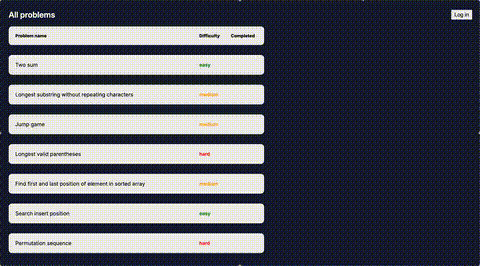

# AI Solver

Make AI solve real-life programming problems by providing prompts and guiding it through the process.
You don't write any code, just provide instructions to the agent of your choice.

## 🎥 Quick Demo



## 🛠️ Tech Stack

Frontend:

- [SvelteKit](https://svelte.dev/) - lightweight frontend framework

Backend:

- [Gin Gonic](https://gin-gonic.com/) - simple API framework for Go
- [SQLite](https://sqlite.org/) - database

Infrastructure/Dev Tools:

- [Docker](https://www.docker.com/) - containerized environment
- [tmux](https://github.com/tmux/tmux/wiki) - terminal workspace management

## 🚀 Getting Started

You can run the project locally in two ways:

1. Directly (no Docker) → best for local development (with hot reloading).

2. With Docker → best for testing production-like behavior.

### 1. Running locally (without Docker)

This method is ideal for active development. Hot reloading makes it convenient to see changes instantly.

#### Requirements

- **Unix-based environment**: macOS or Linux. Windows users should install [Windows Subsystem for Linux](https://learn.microsoft.com/en-us/windows/wsl/install).
- [tmux](https://github.com/tmux/tmux/wiki/Installing)

#### Steps

Clone the project locally:

```text
git clone https://github.com/Serious-Fin/ai-solver.git
cd ai-solver
```

Add the required files:

- `.env` → `/ai-solver/frontend/` (example in `/ai-solver/frontend/.env.example`)
- `.env` → `/ai-solver/api/` (example in `/ai-solver/api/.env.example`)
- `database.db` → `ai-solver/api/data/` (`schema.sql` provided in `/ai-solver/api/data/`)

Run the workspace script:

```text
./workspace.sh
```

Open app in your browser

👉 [http://localhost:5173](http://localhost:5173)

> **Note:** Logging in does not work locally, as OAuth clients are configured to work on original host name.

### 2. Running locally (with Docker)

Ideal for testing app in production environment. Simulates containerized frontend and API communication.

#### Requirements

- [Docker Desktop](https://docs.docker.com/desktop/)

#### Steps

Clone the project locally:

```text
git clone https://github.com/Serious-Fin/ai-solver.git
cd ai-solver
```

Add the required files:

- `.env` → `/ai-solver/frontend/` (example in `/ai-solver/frontend/.env.example`)
- `.env` → `/ai-solver/api/` (example in `/ai-solver/api/.env.example`)
- `database.db` → `ai-solver/api/data/` (`schema.sql` provided in `/ai-solver/api/data/`)

Run docker compose (development version):

```text
docker compose -f compose.dev.yaml up --build
```

Open app in your browser

👉 [http://localhost](http://localhost)
